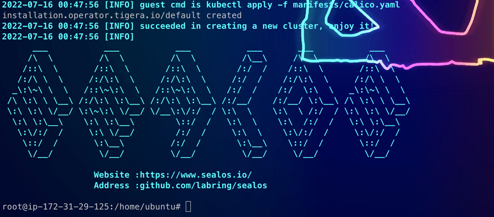

# AthenaServing Framework (ASF)
## 愿景
给任何有需要使用AI能力的场景，提供一致的工程化管理AI能力的方案。任何领域的AI场景的用户，都可以快速的将其算法模型落地成统一标准的HTTP API服务。

## 框架介绍

`AthenaServing Framework(下简称ASF)` AI推理服务框架依托科大讯飞多年的AI算法引擎云服务化经验及云原生的不断探索实践,不仅可以满足引擎云服务化后,服务的稳定性,也可以通过`ASF`享受到相关云原生组件的方便与快捷。AI算法引擎开发者可以专注于算法的演进与研究,无需分心进行硬件资源的管理及云服务化的诸多开发运维工作。

`ASF`是一个专为AI能力开发者打造的AI算法引擎的无服务全托管式平台框架，您可以通过集成 `ASF` 中提供的插件，快速的部署AI算法引擎，并使用网络、分发策略、数据处理等配套辅助系统。引擎托管平台致力于加速AI算法引擎云服务化，并借助云原生架构，为云服务的稳定提供多重保障，您无需关注底层基础设施及服务化相关的开发、治理和运维，即可高效、安全对引擎进行部署、升级、扩缩、运营和监控。

目前部署 `ASF` 需要开发者掌握一定的K8s、helm 等相关知识，且安装部署依赖在线镜像仓库和 helm repo，在离线环境、各式各样的操作系统部署的需求面前有些乏力，sealos 以其`集群镜像`、`images-shim`等方案让应用可以让离线部署变得非常丝滑，无需任何额外操作，sealos 支持了 `ASF` 集群镜像后，让任何人在任何场景、任何环境无障碍交付 `ASF` , 仅需一条命令即可拉起一个 `ASF` 环境。用户可以在 `ASF`框架上集中部署自己的AI能力，对外提供HTTP API。

## AIGES是什么
`AIGES` 是  `ASF`核心的组件，中文名称加载器。主要负责将用户的推理代码(按照既定标准)转换成 grpc/http 服务

## 面向场景
AI能力最终需要落地工程化，部分企业缺乏统一标准的AI工程化方案。

## 解决问题

* AI能力服务化多，无标准
* AI能力服务上线，服务化过程存在大量冗余工作
* 无AI工程化团队 
* 无最终标准服务协议

## 特性

* 基于GRPC优化后的XRPC框架
* 统一标准服务协议定义
* 千亿PV流量打磨
* 支持多种负载均衡策略
* 新增支持Python代码推理
* ...

## 框架架构


## 框架安装

### 前置条件

准备一台测试机(4c8G),硬盘>=20G即可


### 安装

1. 安装sealos.4.0

```shell
$ wget -c https://sealyun-home.oss-cn-beijing.aliyuncs.com/sealos-4.0/latest/sealos-amd64 -O sealos &&  chmod +x sealos && mv sealos /usr/bin
```

  

2. 创建集群

```shell
sealos run labring/kubernetes:v1.19.16 labring/calico:v3.22.1   --masters 192.168.64.2 -p <password>
```




* Install helm

```shell
$ sealos run labring/helm:v3.8.2 
```
* Install openebs
```shell
$ sealos run labring/openebs:v1.9.0 

```

```shell
$ sealos run labring/athena_serving:v2.0.0rc1
```

```shell
$ sealos run labring/demo_mmocr:v3.1
```

3. HTTP 调用AI demo能力 MMOCR能力

```python
import requests
import json
import base64

image = open("demo_text_det.jpg","rb")
img = base64.b64encode(image.read())


url = "http://<your nodeIP>:30889/mmocr"
url = "http://<your nodeIP:30889/v1/private/mmocr"
method = "POST"
headers = {"Content-Type":"application/json"}
data = {
    "header": {
        "app_id": "123456",
        "uid": "39769795890",
        "did": "SR082321940000200",
        "imei": "8664020318693660",
        "imsi": "4600264952729100",
        "mac": "6c:92:bf:65:c6:14",
        "net_type": "wifi",
        "net_isp": "CMCC",
        "status": 3,
        "request_id": None
    },
    "parameter": {
        "mmocr": {
            "category": "ai_category",
            "application_mode": "common_gpu",
            "gpu_id": "first",
            "gpu_type": "T4G16",
            "boxes": {
                "encoding": "utf8",
                "compress": "raw",
                "format": "json"
            }
        }
    },
    "payload": {
        "data": {
            "encoding": "jpg",
            "image": img.decode("utf-8"),
            "status": 3
        }
    }
}

# call the http api.
resp = requests.post(url,headers=headers,data=json.dumps(data))

print(resp.status_code)

if resp.status_code != 200:

    print(resp.json())

result = resp.json()['payload']['boxes']['text']
print("HTTP API response is : %s "% str(result))

print("########################################")

for box in result[0].get("result"):

    msg = "MMocr Result: box located at {box}, box score is {box_score}.  Detected text is {text} , text  score is {text_score}..."
    print(msg.format(**box))
```


## 集成接入您的自定义AI能力

新的AI能力，需要您按照加载器规范，开发并构建出您的 AI能力镜像，之后即可部署到集群。

如何构建您的自定义AI能力镜像，请参考: [快速构建wrapper.py](https://iflytek.github.io/athena_website/docs/%E5%8A%A0%E8%BD%BD%E5%99%A8/Python%E6%8F%92%E4%BB%B6)


## 更多详细内容

* 关注:

[](https://github.com/iflytek)


* 联系:

